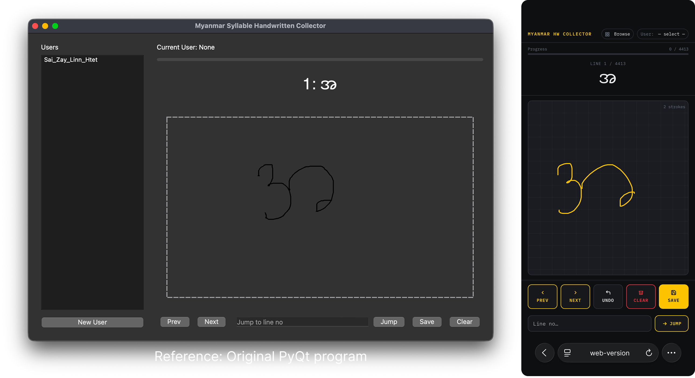
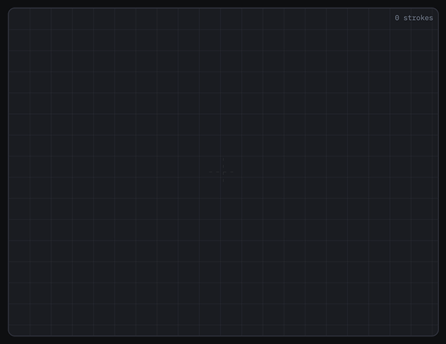
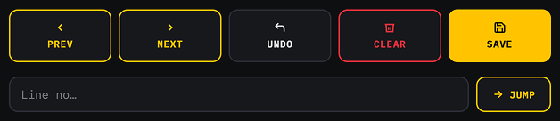
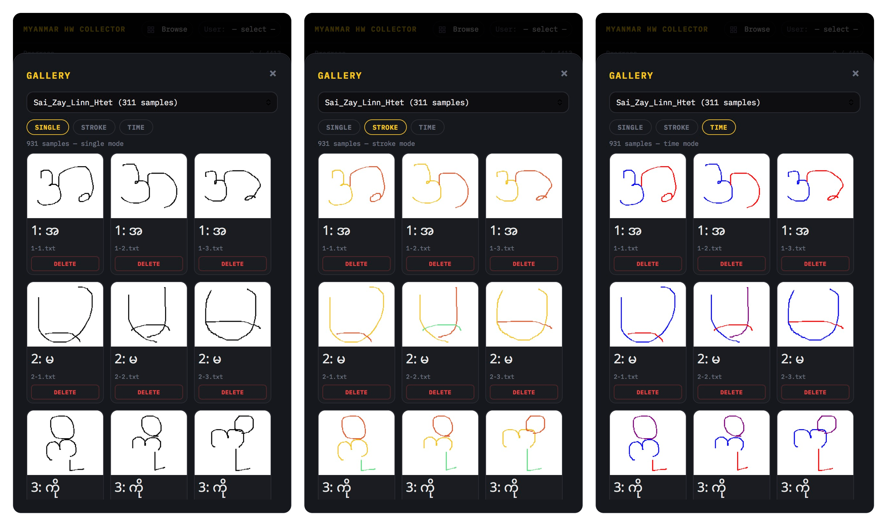
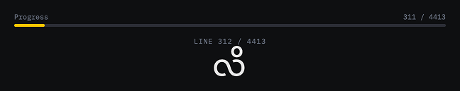

# Myanmar Handwriting Collector (Web Version)

A mobile-friendly web-based system for collecting Myanmar handwritten syllable data. This project extends an original PyQt5 desktop application into a touch-optimized web application, enabling data collection across phones, tablets, and desktops.

This work is developed as part of the **AI Engineering Fundamental Class Assignment**, based on the original implementation by **Dr. Ye Kyaw Thu**.

---

## Overview

The original system provides a desktop interface for collecting handwritten Myanmar syllables using mouse or trackpad input. This project reimplements and extends that system into a **web-based architecture**, preserving core logic while improving accessibility and workflow efficiency.

Key goals:

* Enable handwriting data collection on **touchscreen devices**
* Reduce friction in the data collection process
* Integrate multiple tools into a single interface
* Provide immediate visual feedback for collected data



---

## System Architecture

### Original System (Desktop - PyQt5)

* `hw_collector.py` – handwriting collection UI
* `dataset_browser.py` – dataset browsing tool
* `convert2image.py` – stroke-to-image conversion
* `syl.txt` – syllable dataset

### This Project (Web-Based)

* `index.html` – mobile-first UI (canvas + controls)
* `hw_server.py` – Flask backend API
* `dataset/` – stroke data storage
* `single/`, `stroke/`, `time/` – generated image outputs

The system preserves the **data format and logic** of the original implementation while introducing a new interaction layer.

---

## Features

### 1. Touch-Based Handwriting Input with Stroke Count

Users can draw directly on a canvas using:

* Mobile phones
* Tablets
* Desktop (mouse)



---

### 2. Guided Data Collection (3 Saves per Line)

Each syllable requires **3 samples** before automatically advancing.

* Enforces consistency (as required in the original assignment)
* Eliminates manual “Next” interaction


---

### 3. Stroke-Based Data Capture

Each sample is stored as structured stroke data:

* Stroke segmentation (`STROKE n`)
* Coordinate points `(x, y)`
* Timestamp `t`

This format is fully compatible with the original system.

---

### 4. Undo and Canvas Controls

Improved drawing controls:

* Undo last stroke
* Clear canvas
* Navigate between lines
* Jump to specific line



---

### 5. Integrated Dataset Browser

Browse collected samples directly in the application.

* Visual grid layout
* Per-user dataset separation
* Instant preview of handwritten samples

---

### 6. Real-Time Image Generation (3 Modes)

Instead of running separate commands, images are generated on demand:

* **Single Mode** – black stroke rendering
* **Stroke Mode** – different color per stroke
* **Time Mode** – color progression based on drawing order



---

### 7. Dataset Management

* Delete incorrect samples
* Automatic progress tracking per user
* Organized directory structure



---

### 8. Multi-User Support

Each user has:

* Separate dataset folder
* Individual progress tracking
* Stored metadata (age, sex, education)


---

## Dataset Structure

```
dataset/
  └── <user_name>/
        ├── user_info.json
        ├── 1-1.txt
        ├── 1-2.txt
        └── ...

single/
stroke/
time/
  └── <user_name>/
        └── *.png
```

* `.txt` files store stroke data (original format)
* `.png` files are generated on demand

---

## API Overview

The backend is implemented using **Flask**.

### Core Endpoints

* `GET /api/lines`
  Load syllable list

* `GET /api/users`
  List users and progress

* `POST /api/users`
  Create new user

* `POST /api/save`
  Save stroke data

* `POST /api/gallery/<user>/<mode>`
  Load dataset images (with caching)

* `DELETE /api/delete/<user>/<file>`
  Delete sample and associated images

---

## Quick Start

### 1. Create Virtual Environment

```bash
python -m venv venv
```

### 2. Activate Environment

macOS / Linux:

```bash
source venv/bin/activate
```

Windows:

```bash
venv\Scripts\activate
```

### 3. Install Dependencies

```bash
pip install -r requirements.txt
```

### 4. Run Server

```bash
python hw_server.py --file syl.txt --port 5000
```

### 5. Access Application

On your computer:

```bash
http://localhost:5000
```

On your phone/tablet (same network):

```bash
http://<YOUR_IP>:5000
```

---

## Key Improvements Over Original

| Feature          | Original (Desktop) | This Project (Web)      |
| ---------------- | ------------------ | ----------------------- |
| Input Method     | Mouse / Trackpad   | Touch + Mouse           |
| Navigation       | Manual             | Auto (3 saves per line) |
| Image Generation | CLI (3 commands)   | Integrated (1 click)    |
| Dataset Browser  | Separate app       | Built-in                |
| Undo Function    | Not available      | Available               |
| Delete Function  | Not available      | Available               |
| Accessibility    | Desktop only       | All devices             |

---

## Technical Notes

* Stroke normalization and rendering logic are adapted from the original `convert2image.py`
* Dataset format remains unchanged for compatibility
* Image generation is performed lazily (on request)
* Frontend is implemented using **vanilla JavaScript and HTML5 Canvas**
* Backend uses **Flask + Pillow**

---

## Attribution

This project is built upon the original work by:

**Dr. Ye Kyaw Thu**
AI Engineering Fundamental Class

Original components:

* `hw_collector.py`
* `dataset_browser.py`
* `convert2image.py`
* `syl.txt`

The core logic and dataset format are preserved. This project extends the original system by introducing a web-based interface and additional functionality for improved usability and accessibility.

---

## Purpose

This project is intended for:

* Educational use
* Research in handwriting data collection
* Extension and experimentation by students

---